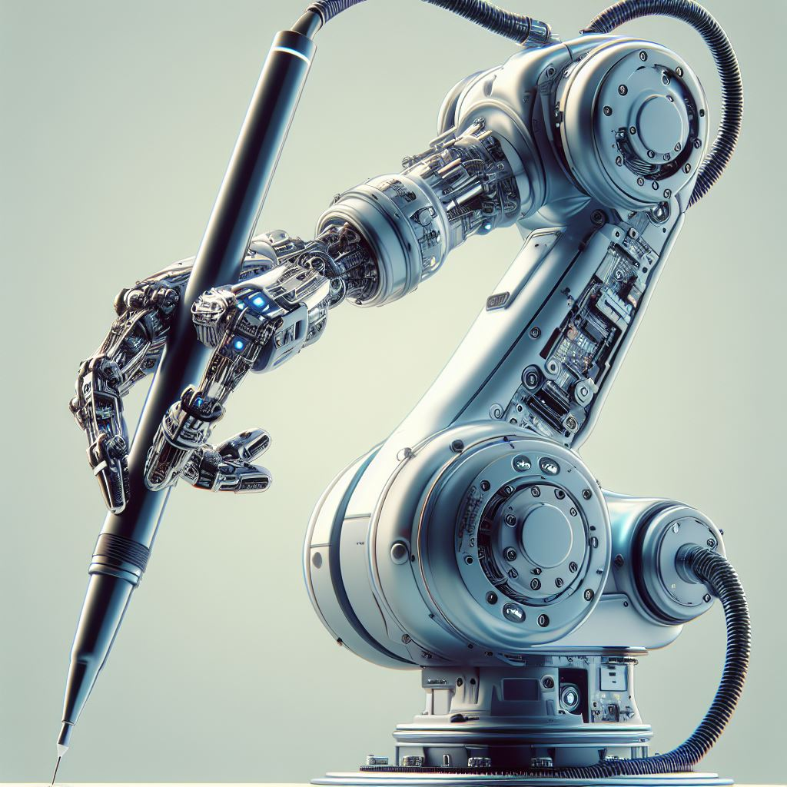

# Selfie Robot UR3

## Overview

  

This project presents a Selfie Drawing using the UR3 Robot arm, which serves Tracing Personal Portraits in under 3 minutes. The project specifically focused on Sketching Outline Portrait of users in a Technology Exhibition at UTS. Through the automated processing of images, this system simplifies the creation of "robotics art," offering an enjoyable and engaging experience for users.

Users can immerse themselves in a unique experience by sitting in front of a 1080p Camera to capture a selfie portrait. Once the user is ready, our system will take a picture and process it to a .svg outline image, which will allow the UR3 robot arm to draw. After finishing the artwork, our technician swiftly replaces the paper, ensuring that the creative journey continues for the next eager customer, ready to embark on their personalized masterpiece.

## Key Features

- **Image Processing**: (made by Sam) Vector graphics offer distinct delineation of facial features, capturing intricate details like the nose, mouth, and eyes with precision. Before undergoing the transformation into vector graphics, raw images are first converted into cartoons, accentuating features for a more stylized representation. Additionally, background removal is implemented to isolate the individual, ensuring that only the person is vectorized, thereby enhancing the focus on the subject's features.

- **Tool Path Planning**: (made by Stewart) The process continues by converting the vectors into Gcode. This Gcode translates the vector graphics into precise instructions for the UR3's movements. Next, the vectors are planned within a 3D plane, ensuring accurate execution of the design. Scaling the vector to the appropriate size is crucial, and curves are drawn in a strategic, non-myopic order, achieved through the resolution of the Travelling Salesman Problem. This meticulous approach optimizes the efficiency and accuracy of the CNC machine's carving process, resulting in a refined and detailed final product.

- **Robot Control**: (made by Long) The movement of the robot exhibits a seamless and impeccable flow, characterized by its smooth execution. This precision is maintained through the implementation of advanced features such as self-collision avoidance and singularities avoidance, ensuring that the robot navigates its environment without compromising its integrity. Furthermore, to achieve optimal drawing conditions, the paper is calibrated, using a depth camera, to ensure a level plane for drawing.

- **GUI and Compliance**: (made by Dennis) The program facilitates calibration procedures for the easel, ensuring precise alignment and setup. Moreover, the end-effector boasts the capability to accommodate multiple tools simultaneously, enhancing versatility and efficiency. With the easel duly configured, the mechanical end-effector seamlessly integrates with it, featuring effective compliance mechanisms for optimal performance. Additionally, users are greeted with an intuitive graphical user interface (GUI), offering a user-friendly platform to initiate and navigate the program effortlessly, thereby streamlining the user experience and promoting accessibility.

## Installation

1. Create a workspace folder in your terminal

`mkdir -p rs2_ws`

2. Navigate to your Workspace

`cd ~/rs2_ws`

3. Clone the Repository

`git clone https://github.com/LongThinhLe/robotics_studio2.git`

4. Navigate to **/src** folder

`cd ~/rs2_ws/robotics_studio2/src/selfie_drawing_ur3/scripts`

5. RUN the file GUI.py

`python3 GUI.py`

6. If you don't have `python3` in your Linux, use:

`pip install python3`
